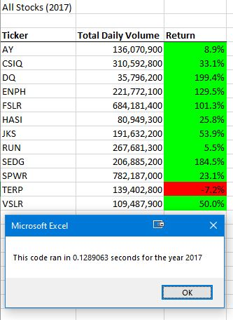
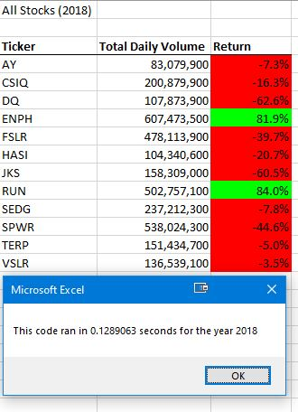

# Stock-Analysis

## **Overview of Project**

### To assist Steve in analyzing the dataset of the entire stock market over the last few years by utilizing a refactored code based on the original solution code.

## **Results**

### **Stock Performance between 2017 and 2018**

  _1. Upon comparing the stock performance, we can see that all the stocks had a negative return in 2018, except for ENPH and RUN._

  _2. ENPH continued to retain a positive return rate in 2018, which was relatively lower than in 2017._

  _3. RUN outperformed the other stocks in 2018, with an approximately 78.5% increase in return compared with 2017._

  _4. TERP continued to underperform in 2018, with a 5% loss in return; however, the loss was relatively minor than in 2017._ 

  

  

### **Execution Time Comparison between the Original Script and the Refactored Script**

  _1. For the year 2017, the execution time of the original script is about 0.796875 seconds. With the refactored script, the execution time can be shortened to 0.1289063 seconds, approximately six times faster than the original script._ 
  
  

  

  _2. For the year 2018, the execution time of the original script is about 0.765625 seconds. With the refactored script, the execution time can be shortened to 0.1289063 seconds, approximately six times faster than the original script._ 

  
  
  

## **Summary**

- **What are the advantages and disadvantages of refactoring code in general?**

  - _Advantages of Refactoring Code:_

   - _Improve the design of the software._

   - _Simplify the code and make it easier to understand._

   - _Help the developer find bugs._

   - _Enhance the efficiency and help the program run faster._ 
  
  - _Disavantages of Refactoring Code:_

   - _Refactoring code is very time-consuming._

   - _There is a chance of creating bugs/errors during the refactoring process._

   - _It is risky when the existing code doesn't have a comprehensive data set for a test, which will lead to a situation that the developer has no clue how to fix the new bugs/errors._

- **What are the advantages and disadvantages of the original and refactored VBA script?**

  - _Original VBA script:_

   - _Advantanges:_

    - _1. 11
